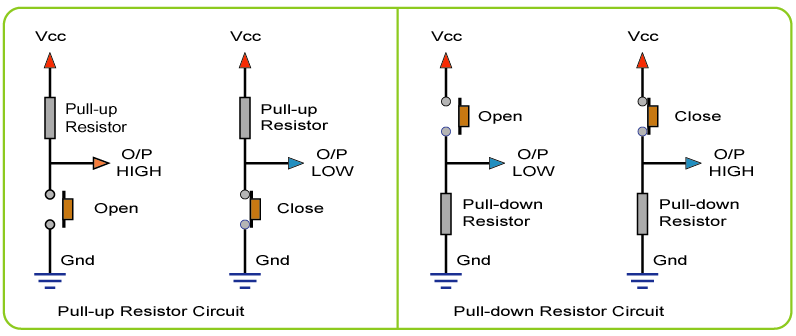

#  Open Virtual Steering with DiscreteHIDs

The **Romans** knew it already: **`"Sterzare Necesse Est"`** (free after Plutarch), and it still holds true in the world of **virtual cycling**.

<details>
<summary>What it means</summary>
  
The original quote **Navigare Necesse Est** ("Navigation is Necessary") was humorously adapted here by replacing _Navigare_ with the Italian verb for [**Steering**](https://en.wiktionary.org/wiki/sterzare), aligning it with the project's theme.
</details>

This repo is part of the **Open Virtual Steering (OVS)** initiative, an open-source exploration of alternative **Human Interface Devices (HIDs)** for **virtual steering** in indoor cycling platforms. This specific repository demonstrates **discrete-style HIDs** like:

## 🧩 Included HID Input Methods

- 🟢 **Buttons** (Left/Right pushbuttons)
- 🟠 **PS2-style Analog Joystick**
- 🔵 **Rotary Encoder** (EC11)

These interfaces are ideal for **compact, responsive handlebar-mounted controls** that are simple to build and customize.


## 📚 Other OVS Repositories in this Project
- [`Bluefruit-Steering-Server`](https://github.com/Berg0162/Bluefruit-Steering-Server) - Critical Shared Backend (Arduino library)
- [`Open-Virtual-Steering-MotionIMU-Bluefruit`](https://github.com/Berg0162/Open-Virtual-Steering-MotionIMU-Bluefruit) – Using IMUs like the MPU6050  

### 🧭 How It Works

This firmware acts as a **Bluefruit Steering Controller**, combining two core components:

1. 🧱 **BluefruitSteeringServer**  
   A standalone library that manages Bluetooth Low Energy (BLE) communication, including advertisement, pairing, and steering data transmission using a standardized steering profile.

2. 🎮 **Discrete HID Handler**  
   This repository provides input from **simple human interface devices**, including buttons, joysticks, and rotary encoders. These inputs are sampled and converted into discrete steering-angle values.

In the handler, the selected HID device is read, interpreted as a left/right/center signal or analog deflection, and in the main program loop steering-angle values are passed to `BluefruitSteeringServer::updateSteeringValue()` for BLE transmission to a connected client (e.g., a virtual cycling platform).

The code structure allows:
- Easy switching between input devices
- Expansion to other HID types if desired

## 🧱 Dependencies

+ [Adafruit nRF52 Arduino Core](https://github.com/adafruit/Adafruit_nRF52_Arduino)
+ [Adafruit Bluefruit Library (Source)](https://github.com/adafruit/Adafruit_nRF52_Arduino/tree/master/libraries/Bluefruit52Lib)
+ [BluefruitSteeringServer](https://github.com/Berg0162/Bluefruit-Steering-Server)
+ HID dependent library
  - [OneButton](https://docs.arduino.cc/libraries/onebutton)

> 💡 This library is built specifically for **Adafruit's Bluefruit platform**, and is not compatible with NimBLE-based ESP32 boards.

### **Supported MCU Boards**
+ Nordic Semiconductor **nRF52 series**
  - 🟢 Adafruit Feather nRF52840 Express
  - 🟢 Adafruit ItsyBitsy nRF52840
  - 🟢 Adafruit CLUE, Bluefruit Sense, and other nRF52 boards with BLE support

To install the core:
- Follow Adafruit's guide: [Install Adafruit nRF52 Arduino Core](https://learn.adafruit.com/bluefruit-nrf52-feather-learning-guide/arduino-bsp-setup)

## 🧪 Testing & Validation

All examples were tested using [**nRF Connect for Mobile**](https://www.nordicsemi.com/Products/Development-tools/nRF-Connect-for-mobile) for BLE connection and debugging. Each discrete HID was validated for:
- Input detection
- Stability of BLE connection
- Timely transmission of steering data

## ⚠️ Disclaimer

<details>
<summary>💡 <b>Research & Independence</b></summary>
This project is <b>not affiliated with, endorsed by, or associated with any commercial virtual cycling platform or steering device manufacturer</b>. It is a <b>research and interoperability</b> initiative designed to explore <b>alternative human interface methods</b> in the context of indoor cycling. All development is conducted independently for <b>educational and experimental purposes</b>.
</details>

<details>
<summary>✅ <b>Compliance & Responsibility</b></summary>
This repository does <b>not include or promote any circumvention of technological protection measures</b>, reverse engineering of proprietary software, or unauthorized access to restricted systems. Users are <b>solely responsible</b> for ensuring that their use of this code complies with <b>local laws, software licenses, and platform terms of service</b>.
</details>

<details>
<summary>🔍 <b>Copyright & Contact</b></summary>
If you are a <b>rights holder</b> and believe this project includes content that <b>violates your intellectual property rights</b>, please <b>open an issue</b> in this repository. We are committed to responding promptly and respectfully to legitimate concerns.
</details>

## 🚀 Quick Start

1. Download or clone this repository.
2. Unzip (if needed) and move the folder into your Arduino Sketchbook:
3. Open the `.ino` file manually in Arduino IDE.
4. Ensure required libraries are installed (see Dependencies).
5. Compile and upload to your board.

> ℹ️ The sketch file name may differ from the repository name. This is intentional for better versioning and description.

# 🧩 Included HID Input Methods

To select one of the discrete Human-Interface-Devices that was explored: 
- Uncomment in the main code the HID-associated include. Notice that sometimes there are 2 entries with different implementations.
- Study the specific header file for wiring instructions and additional installation of a specific Arduino library.<br>
See main code snippet:

```C++
// -----------------------------------------------------------------------------------
// Include specific HCI device/sensor functions for input of steering state and actions
// -----------------------------------------------------------------------------------
//#include "twoButtons.h"
#include "twoButtonsPlus.h"
//#include "rotaryEncoder.h"
//#include "ps2JoyStick.h"
// -----------------------------------------------------------------------------------
```

## 🟢 **Buttons** (Left/Right pushbuttons)

<br>

The easiest way is connecting two push buttons for steering left/right. Any push-button will do. However, a membrane push button has the advantage that it is not very sensitive to fluids. In the context of indoor cycling that can be a point of concern!<br>
<b>Wiring the two buttons correctly</b><br>
Wire the buttons to the GPIO pins of the respective development boards in accordance with the settings in the code, or change the settings!
<br clear="left">

- PullUP<br>
The most simple setup is to activate and use the internal pullup resistor that these SOC's offer: connect a button at one side to the GPIO pin of your choice and the other button side to ground. When the button is pushed/closed the GPIO pin will go to logical LOW.

```C++
    // initialize the LEFT/RIGHT pushbutton pins as an input:
    pinMode(buttonPin_RIGHT, INPUT_PULLUP); // button pushed --> LOW
    pinMode(buttonPin_LEFT, INPUT_PULLUP);  // button pushed --> LOW   
```

<p align=center></p>

- PullDOWN<br>
Connect a button at one side to the GPIO pin of your choice <b>and</b> to ground with a 10kOhm resistor. The other button side is connected to Vcc. When the button is pushed/closed the GPIO pin will go to logical HIGH.<br>

```C++
    // initialize the LEFT/RIGHT pushbutton pins as an input:
    pinMode(buttonPin_RIGHT, INPUT); // button pushed --> HIGH
    pinMode(buttonPin_LEFT, INPUT);  // button pushed --> HIGH
```

## 🟠 **PS2-style Analog Joystick**

<br>
Generations grew up with game controllers that have buttons and a Joy Stick. Many consider this an ideal HID, so it it can't be missing from the list! Mounting it on the handlebar can be a point of concern.<br>
Connect the PS2 Joy Stick pins to the different developement boards as as is detailed below:<br>
<br clear="left">
- nRF52840/nRF52832
```C++
/* ------------------------------------------------------------------------------------------------
 * Warning I/O Pins have identical position but different naming depending on the processor board
 * I/O Pin declarations for connection to PS2 Joy Stick */
#if defined(ARDUINO_NRF52840_FEATHER) 
#define PS2_PIN_VRX  A0 // --> A0/P0.04 analog pin connected to VRX output
#define PS2_PIN_VRY  A1 // --> A1/P0.05 analog pin connected to VRY output
#define PS2_PIN_SW   A2 // --> A2/P0.06 digital pin connected to SW-switch output
// PS2_PIN_GND to Feather pin GND and PS2_PIN_5Volt to Feather pin Vcc 3 Volt !!
#endif
#if defined(ARDUINO_NRF52832_FEATHER)
#define PS2_PIN_VRX  2 // --> A0/P0.02 analog pin connected to VRX output
#define PS2_PIN_VRY  3 // --> A1/P0.03 analog pin connected to VRY output
#define PS2_PIN_SW   4 // --> A2/P0.04 digital pin connected to SW-switch output
// PS2_PIN_GND to Feather pin GND and PS2_PIN_5Volt to Feather pin Vcc 3 Volt !!
#endif
//-------------------------------------------------------------------------------------------------
```

## 🔵 **Rotary Encoder** (EC11)

<br>

We apply the included EC11 class and the following wiring: <br>
<br clear="left">

```C++
#include "EC11.hpp"

/* ------------------------------------------------------------------------------------------------
 * Warning I/O Pins have identical position but different naming depending on the processor board
 * I/O Pin declarations for connection to Rotary Encoder */
#if defined(ARDUINO_NRF52840_FEATHER) 
#define ENC_PINA_CLK A2 // CLK ENCODER -> Connect PinA with a 10K Ohm Pullup resistor to Vcc 3 Volt
#define ENC_PINB_DT  A3 // DT  ENCODER -> Connect PinB with a 10K Ohm Pullup resistor to Vcc 3 Volt
// --> Connect ENCODER PinC to GND
// --> Connect ENCODER PinD with a 10K Ohm Pullup resistor to Vcc 3 Volt
#define ENC_PINE_SW  A4 // SW ENCODER Switch PinE
#endif
#if defined(ARDUINO_NRF52832_FEATHER)
#define ENC_PINA_CLK 4 // CLK ENCODER -> Connect PinA with a 10K Ohm Pullup resistor to Vcc 3 Volt
#define ENC_PINB_DT  5 // DT  ENCODER -> Connect PinB with a 10K Ohm Pullup resistor to Vcc 3 Volt
// --> Connect ENCODER PinC to GND
// --> Connect ENCODER PinD with a 10K Ohm Pullup resistor to Vcc 3 Volt
#define ENC_PINE_SW  6 // SW ENCODER Switch PinE
#endif
```

Notice: the pullup resistors are critical for a reliable operation!!<br>

---

<details>
<summary>⚖️ <b>Legal Notice (EU Context)</b></summary>

This project is developed and published in accordance with **EU directives** that recognize the right to study, test, and develop software components for the purpose of achieving **interoperability** (e.g., Directive 2009/24/EC on the legal protection of computer programs, Article 6).  

No part of this project is intended to **infringe upon intellectual property rights** or violate technological protection measures. All content is shared in good faith under the belief that it falls within the bounds of **legitimate research, reverse engineering for interoperability, and fair use under EU law**.  

Users must ensure their own compliance with **national implementations of EU directives**, and are responsible for how they apply or modify this code.

</details>

---

> ⭐ Contributions welcome! Feel free to fork, adapt, or open pull requests to improve this open virtual steering toolkit.
